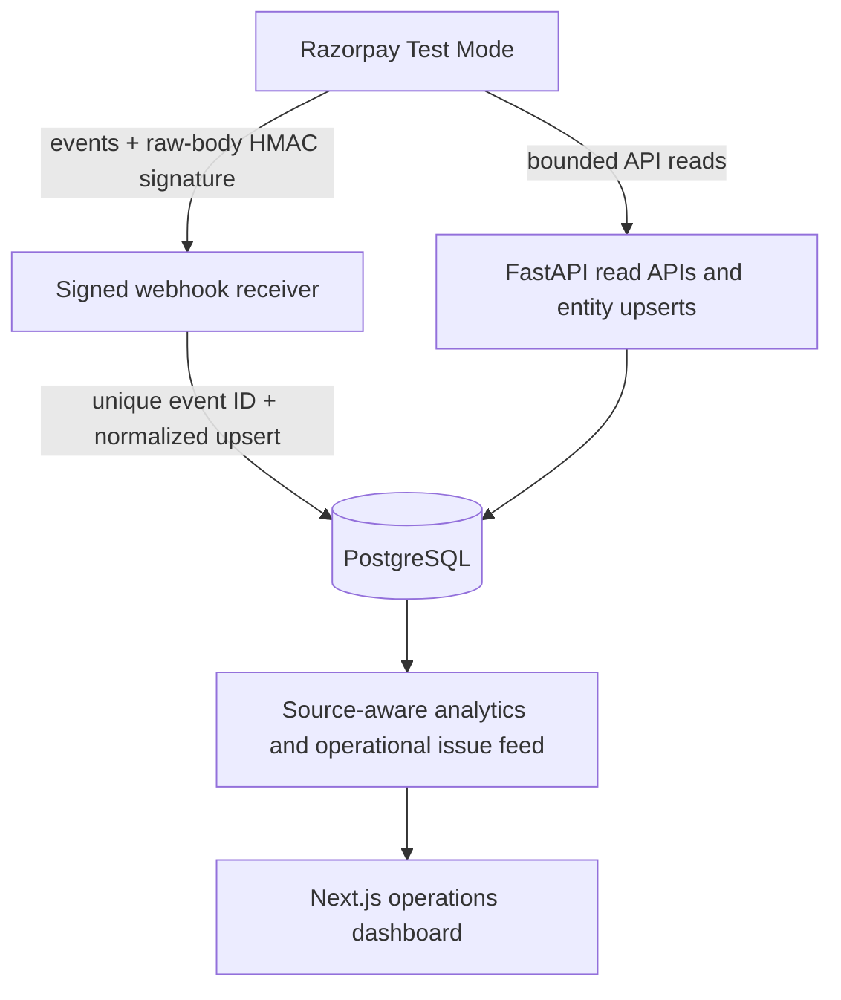
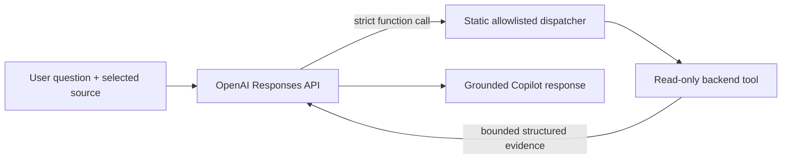

# PayOps AI architecture

PayOps AI separates operational persistence, deterministic financial logic, AI explanation, and synthetic evaluation. It remains read-only and uses Razorpay Test Mode only.

## Operational data path



Demo and Razorpay records belong to separate merchants identified by `source=demo|razorpay`; `source=all` aggregates them only at the query layer. Webhook order is not assumed. Unique provider event IDs and external entity IDs provide idempotency and duplicate protection.

## Controlled AI path



The model receives no SQL/database tool, credentials, arbitrary code tool, or mutating financial function. Nine strict tools cover dashboard metrics, failure investigation, comparisons, bounded payment facts, settlement variance, reconciliation issues, alerts, and normalized payment details. Calls are validated, source-forced and capped at six rounds. Customer email and phone are removed from tool output.

## Deterministic evaluation path

```mermaid
flowchart LR
    G[Synthetic generator] -->|financial evidence| E[Reconciliation engine]
    G -->|labels kept outside engine| V[Evaluator]
    E -->|prediction + reason + evidence| V
    V --> M[Metrics / confusion / case audit]
    M --> J[GET /api/evaluation]
    J --> UI[/evaluation]
```

Benchmark A is the frozen 120-case Specification Benchmark. Benchmark B is a separate 36-case adversarial Robustness Suite with a richer workflow adapter. They are scored independently. The evaluation package imports neither SQLAlchemy nor OpenAI and performs no operational database access. Results are cached once per backend process for the UI; CLI JSON remains generated and ignored.

Ground truth is held by the evaluator, not passed to either decision function. The two retained B mismatches are unsupported split-capture matches safely returned as `UNRESOLVED`. See [metric definitions](evaluation.md) and the [integrity audit](evaluation-integrity.md).

## Data and calculation boundaries

- PostgreSQL stores money as integer minor units (paise for INR).
- Backend services and deterministic rules perform calculations and data shaping.
- The frontend displays API results and does not implement finance arithmetic.
- The evaluation evidence model is isolated; benchmark cases never enter operational tables or Copilot tools.
- The AI can explain operational evidence but cannot determine benchmark scores or perform mutations.

## Explicit non-goals

Razorpay Live Mode/account linking, authentication, production multi-tenancy, split-capture aggregation, general settlement-batch allocation, chargebacks/FX, and production observability are not implemented. No capture, refund, transfer, settlement, issue-resolution, or other money-moving tool exists.
